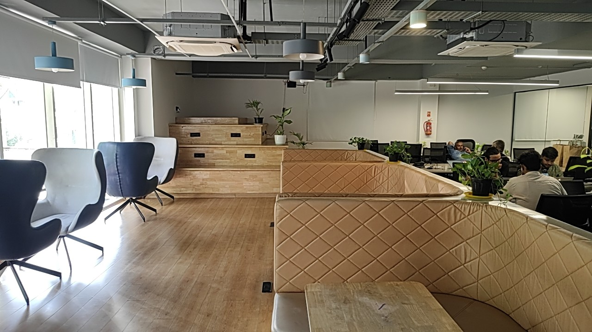
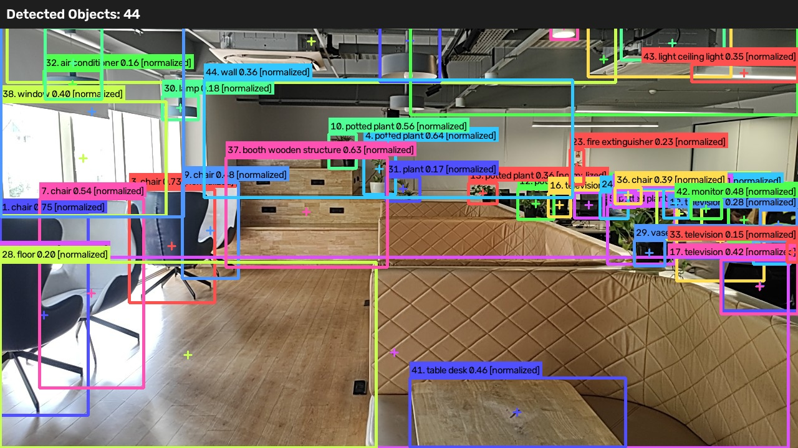
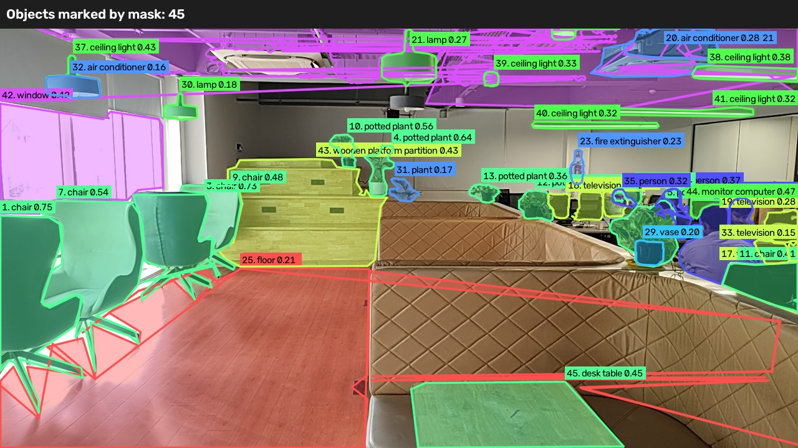
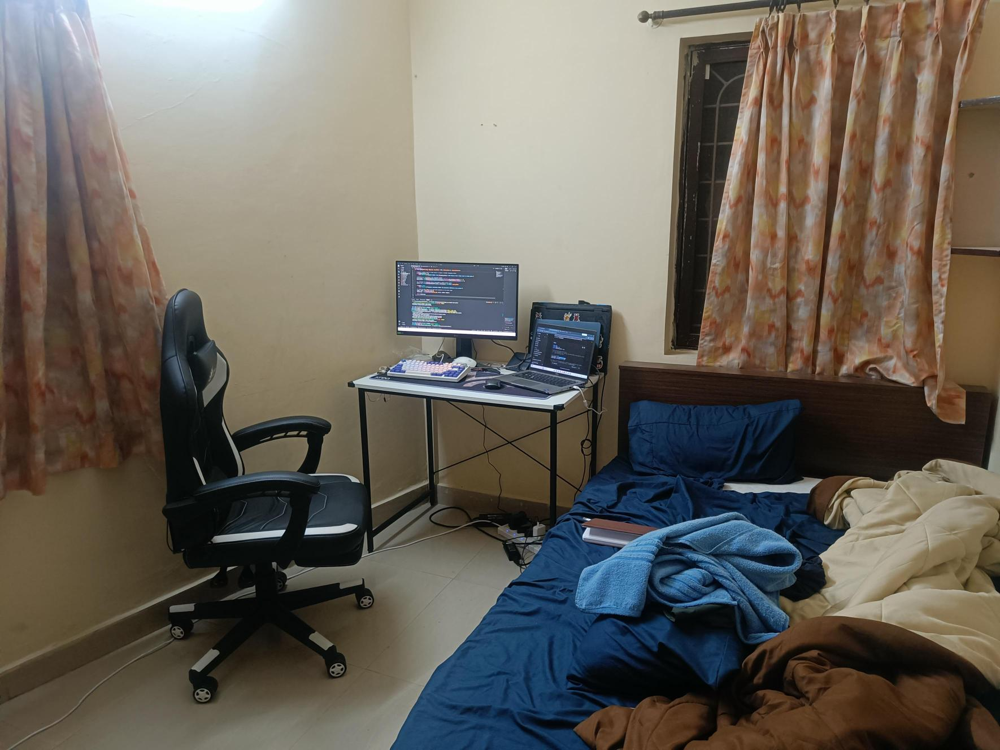
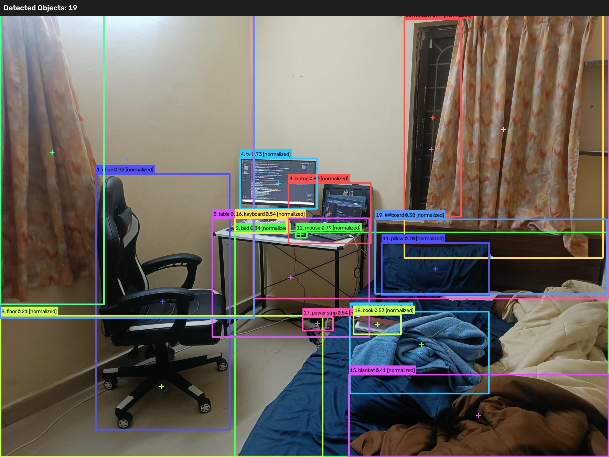
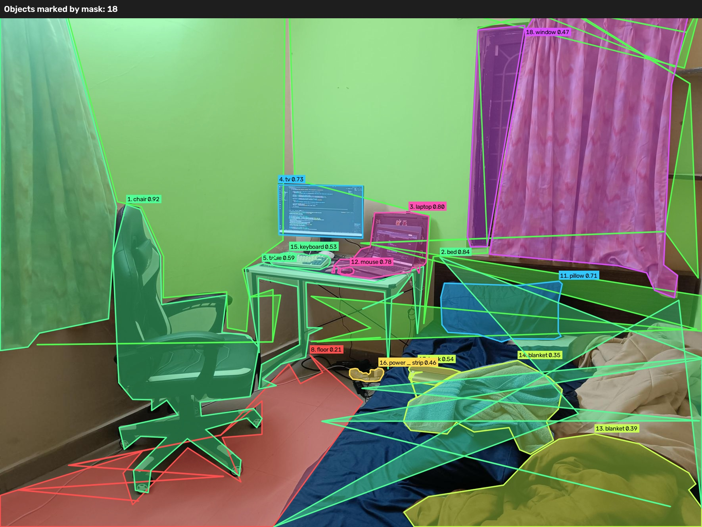
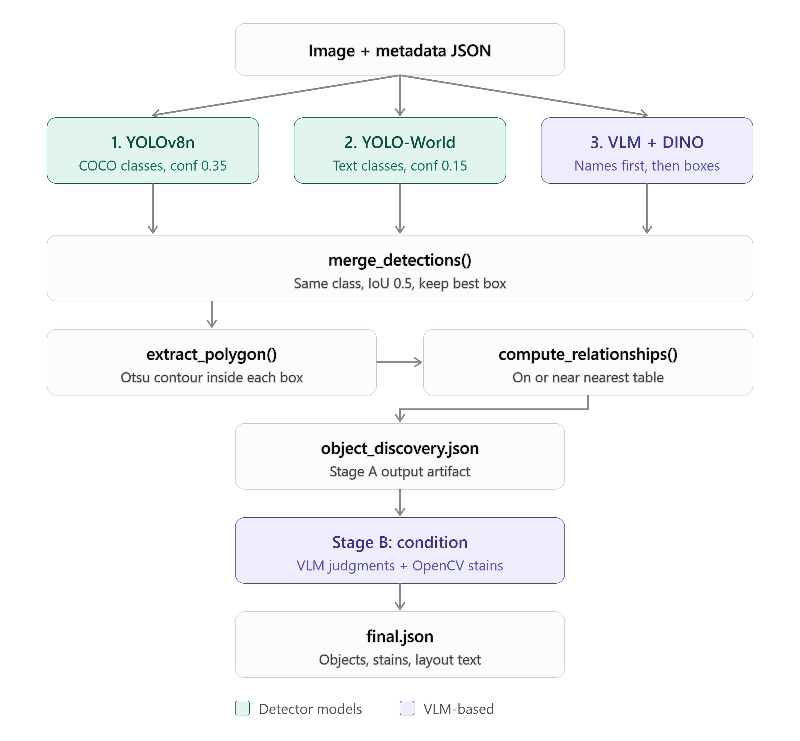
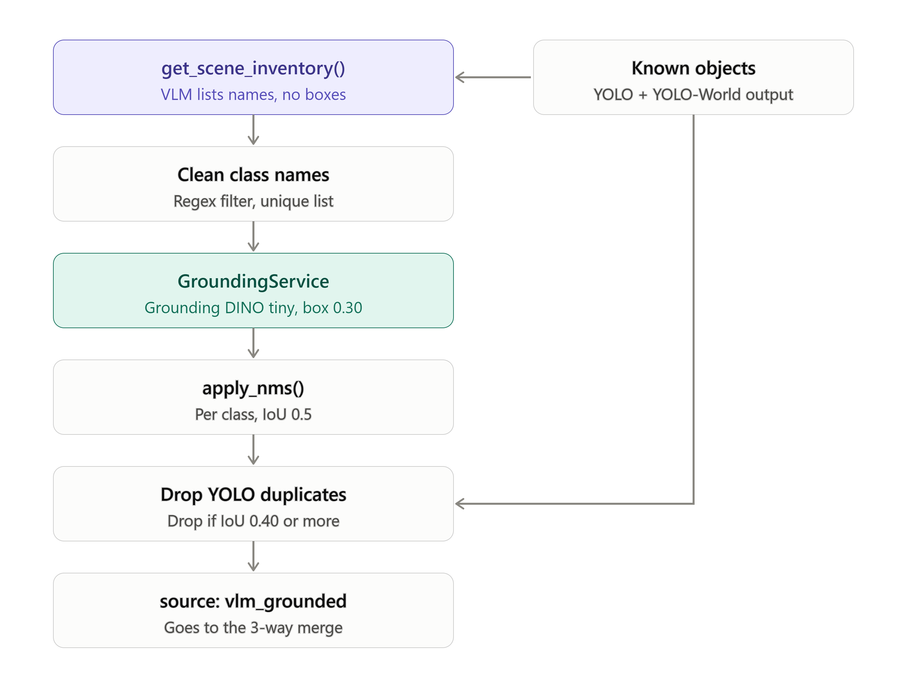

# Nudge - Stage 3 Feature Extraction Pipeline (`anji` branch)

Nudge takes **one photo of a cafe area plus a small metadata JSON** and produces a
structured inventory of what is in the photo: which objects are present, where they
are, how they relate to each other, what condition they are in, and whether their
surfaces have stains.

There is **no master/reference image** in this branch. Each capture is analysed on its own.

---

## Table of contents

1. [How it works](#how-it-works)
2. [Project structure](#project-structure)
3. [Setup](#setup)
4. [Configuration](#configuration)
5. [Running](#running)
6. [Object detection in detail (Stage A)](#object-detection-in-detail-stage-a)
7. [Condition analysis in detail (Stage B)](#condition-analysis-in-detail-stage-b)
8. [Output files and JSON shape](#output-files-and-json-shape)
9. [Graceful degradation without a VLM key](#graceful-degradation-without-a-vlm-key)
10. [Libraries used](#libraries-used)
11. [Known issues](#known-issues)
12. [Adding a new feature](#adding-a-new-feature)

---

## How it works

<!--  -->

<details>
<summary>Text version of the same diagram</summary>

```
image + metadata JSON
        |
        v
+--------------------------- STAGE A: OBJECT DISCOVERY ---------------------------+
|  pipeline/discovery.py                                                          |
|                                                                                 |
|  Branch 1  YOLOv8n            (COCO classes, conf >= 0.35)                      |
|  Branch 2  YOLO-World         (free-text class list, conf >= 0.15)              |
|  Branch 3  VLM + Grounding DINO (VLM names objects, DINO finds their boxes)     |
|        \            |            /                                              |
|         +-----> merge_detections()  (same class + IoU >= 0.5 -> one object)     |
|                      |                                                          |
|              extract_polygon()      (Otsu contour + orientation per object)     |
|                      |                                                          |
|              compute_relationships() (on / near the nearest table)              |
|                      |                                                          |
|        outputs/<capture_id>_object_discovery.json                               |
+---------------------------------------------------------------------------------+
        |
        v
+--------------------------- STAGE B: CONDITION ----------------------------------+
|  pipeline/condition_analysis.py                                                 |
|  - VLM per object crop: material, condition, cleanliness, issues                |
|  - OpenCV stain candidates on exposed surfaces -> VLM verdict per candidate     |
|  - VLM layout description of the whole scene                                    |
|        outputs/<capture_id>_condition_analysis.json                             |
+---------------------------------------------------------------------------------+
        |
        v
outputs/<capture_id>_final.json
```

</details>

Stage A is where object detection happens. Stage B judges what Stage A found.

> **Images:** the workflow diagrams in `docs/images/*.svg` are ready to use. The three `*.png` files in
> `docs/images/` are placeholders; overwrite them with your own screenshots using the same file names.

### Sample input and output

Both images below are in the repo's `images/` folder. The overlay was drawn from a discovery JSON with `tests/test.py`
(boxes, polygons, labels and confidences).

| Input: `images/daily_2.jpg` | Output overlay: `tests/marked_objects_corrected-2.jpg` | Segmented_output: `tests/images_out/marked_masks.jpg`|
|---|---|---|
|  |  | |


| Input: `images/master.jpg` | Output overlay: `tests/marked_objects_corrected-1.jpg` | Segmented_output: `tests/images_out/marked_masks_MASTER.jpg`|
|---|---|---|
|  |  | |

---

## Project structure

```
Nudge-anji/
├── main.py                        CLI entry point
├── requirements.txt
├── yolov8n.pt                     YOLOv8 nano weights (COCO)
├── yolov8s-worldv2.pt             YOLO-World small weights
├── config/
│   └── settings.py                All thresholds, class lists and VLM provider settings
├── core/
│   ├── artifacts.py               save_artifact / load_artifact (JSON per capture_id)
│   └── schemas.py                 TypedDicts documenting the JSON contract (not enforced at runtime)
├── models/
│   ├── yolo_loader.py             load_yolo(), load_yolo_world() - cached model loaders
│   ├── vlm_client.py              OpenAI-compatible VLM client (inventory, condition, stain, layout)
│   └── grounding_service.py       Grounding DINO wrapper (text prompt -> boxes)
├── object_detection/
│   ├── detector.py                YOLOv8 and YOLO-World detection
│   ├── vlm_inventory.py           Branch 3: VLM names -> Grounding DINO boxes -> NMS -> IoU filter
│   ├── merge.py                   3-way merge, dedup, object counts
│   ├── polygon.py                 Contour polygon + orientation per object
│   └── relationships.py           "on" / "near" relations to tables
├── pipeline/
│   ├── discovery.py               Stage A orchestration
│   ├── condition_analysis.py      Stage B orchestration
│   └── run_stage3.py              Runs A then B, writes final JSON
├── semantic/
│   └── enrich.py                  Applies VLM results to objects, stains and layout
├── surface_condition/
│   ├── masking.py                 Exposed-surface crop (surface minus objects on it)
│   └── stain_detection.py         OpenCV stain candidates + FFT periodic-pattern check
├── preprocessing/
│   ├── quality_gate.py            Laplacian-variance blur check (not wired in, see Known issues)
│   ├── lighting.py                CLAHE lighting normalisation (not wired in)
│   └── alignment.py               ORB + homography alignment (not used; no master image)
├── utils/
│   └── box_utils.py               IoU, bbox validation, per-class NMS
├── images/                        Sample images (daily_2.jpg is the default input)
├── docs/images/                   Workflow diagrams (SVG) and screenshot placeholders used by this README
├── metadata/daily_image.json      Sample capture metadata
├── outputs/                       Generated JSON artifacts
└── tests/
    ├── test.py                    Draws boxes/polygons from a discovery JSON onto the image
    └── test_vlm.py                Standalone VLM connectivity test (HuggingFace router)
```

---

## Setup

Requires Python 3.10 or newer (the code uses `X | None` type syntax).

```bash
python -m venv .venv
source .venv/bin/activate        # Windows: .venv\Scripts\activate
pip install -r requirements.txt
```

Create a `.env` file in the project root (it is git-ignored) with the key for your chosen VLM provider:

```env
VLM_PROVIDER=nvidia
NVIDIA_API_KEY=your-key-here
```

The model weights `yolov8n.pt` and `yolov8s-worldv2.pt` are looked up in the project root.
`.gitignore` excludes `*.pt`, so a fresh clone will not contain them; Ultralytics normally
downloads them on first use.

On first run with a VLM key, `GroundingService` downloads `IDEA-Research/grounding-dino-tiny`
from HuggingFace. It uses CUDA if available, otherwise CPU.

---

## Configuration

Everything tunable lives in `config/settings.py`. Values marked "env" can be overridden with
environment variables or `.env`.

### Detection

| Setting | Default | Env var | Meaning |
|---|---|---|---|
| `YOLO_WEIGHTS_PATH` | `yolov8n.pt` | `YOLO_WEIGHTS_PATH` | Standard COCO detector |
| `YOLO_CONFIDENCE_THRESHOLD` | `0.35` | `YOLO_CONF_THRESHOLD` | Minimum YOLO confidence |
| `YOLO_WORLD_WEIGHTS_PATH` | `yolov8s-worldv2.pt` | `YOLO_WORLD_WEIGHTS_PATH` | Open-vocabulary detector |
| `YOLO_WORLD_CONFIDENCE_THRESHOLD` | `0.15` | `YOLO_WORLD_CONF_THRESHOLD` | Minimum YOLO-World confidence |
| `YOLO_WORLD_CLASSES` | ~50 names | no | Text classes YOLO-World searches for (floor, wall, window, chair, plate, spoon, napkin, fan, fire extinguisher, ...) |
| `CLASS_SYNONYMS` | see file | no | Names treated as the same class when merging (for example `dining table` to `table`) |
| `SURFACE_ANCHOR_CLASSES` | `table`, `dining table` | no | Objects other things are said to be "on" or "near" |
| `STRUCTURAL_CLASSES` | floor, wall, ceiling, window, door | no | Skipped in relationship building |

### VLM provider

Selected by `VLM_PROVIDER` (`nvidia` by default). All providers are called through the `openai` SDK.

| Provider | Key env var | Default base URL | Default model |
|---|---|---|---|
| `nvidia` | `NVIDIA_API_KEY` | `https://integrate.api.nvidia.com/v1` | `nvidia/nemotron-3-nano-omni-30b-a3b-reasoning` |
| `ollama` | `OLLAMA_API_KEY` | `http://localhost:11434/v1` | `qwen2.5vl:7b` |
| `huggingface` | `HF_TOKEN` | `https://router.huggingface.co/v1` | `deepseek-ai/DeepSeek-V4-Flash-Vision-Exp` |

Overrides: `VLM_API_KEY_ENV`, `VLM_BASE_URL`, `VLM_MODEL`, `VLM_TEMPERATURE` (0.1),
`VLM_INVENTORY_MAX_TOKENS` (5000), `VLM_CONDITION_MAX_TOKENS` (300), `VLM_DEBUG` (`1` for verbose logs).

### Stain detection

| Setting | Default | Meaning |
|---|---|---|
| `STAIN_MAX_CANDIDATES_PER_OBJECT` | 5 | Top candidates kept per surface or object |
| `STAIN_MAX_CANDIDATES_TOTAL` | 30 | Hard cap on stain crops sent to the VLM per image |
| `STAIN_PERIODIC_PEAK_RATIO` | 60.0 | FFT peak-to-mean ratio above which a region counts as a repeating pattern |
| `STAIN_MASK_ERODE_PX` | 4 | Shrinks the exposed-surface mask so object edges do not leak in |
| `STAIN_SCAN_CLASSES` | tables, chairs, floor, wall, tableware, ... | Classes that get the OpenCV stain scan |

### Other

`NUDGE_OUTPUT_DIR` (default `outputs`), `BLUR_VARIANCE_THRESHOLD` (100.0),
`AMBIENT_LUX_CLAHE_THRESHOLD` (250.0), and the ORB alignment constants.
The last three are only used by preprocessing modules that the current pipeline does not call.

---

## Running

```bash
# Whole pipeline (Stage A then Stage B), default image images/daily_2.jpg
python main.py

# Choose the image and metadata
python main.py --image images/daily_2.jpg --metadata metadata/daily_image.json

# Stage A only: writes <capture_id>_object_discovery.json
python main.py --stage discovery

# Stage B only from a saved discovery file (see Known issues, currently broken)
python main.py --stage condition --discovery-json outputs/cap_690205_object_discovery.json
```

Metadata is a JSON file. Only `capture_id` is used to name the output files
(`capture` is used if it is missing). Other fields, such as `master_reference_id`, `quality_gate`,
`spatial_alignment`, `camera_specs` and `environment`, are read or copied through but do not
change detection.

To visually check detections, use `tests/test.py`. It draws boxes, labels and centroids from a
discovery JSON onto the image. Its `JSON_PATH` and `IMAGE_PATH` constants are hardcoded Windows
paths, so edit them first.

---

## Object detection in detail (Stage A)

Entry point: `pipeline/discovery.py::run_object_discovery()`.



### Branch 1: YOLOv8n - `object_detection/detector.py::detect_objects`

1. `models/yolo_loader.py::load_yolo()` loads `yolov8n.pt` once and caches it in memory.
2. The model runs on the image and each box is read from `r.boxes`.
3. Boxes with confidence below `YOLO_CONFIDENCE_THRESHOLD` (0.35) are dropped.
4. The class name comes from `yolo_model.names` (the 80 COCO classes).
5. `_make_object()` builds the standard object dict, with `source: "yolo"` and ids like `obj_001_chair`.

### Branch 2: YOLO-World - `detect_open_vocabulary_objects`

1. `load_yolo_world()` loads `yolov8s-worldv2.pt`.
2. YOLO-World accepts free-text class names. `set_classes()` converts `YOLO_WORLD_CLASSES` to text
   embeddings. This is slow, so it only re-runs when the class list changes.
3. The model runs with the lower threshold `YOLO_WORLD_CONFIDENCE_THRESHOLD` (0.15).
4. Objects get `source: "yolo_world"` and ids like `obj_ov_001_floor`.

This branch covers what COCO cannot: floor, wall, ceiling, window, cutlery, napkins, fire extinguishers and similar.

### Branch 3: VLM inventory + Grounding DINO - `object_detection/vlm_inventory.py`

This branch is skipped (returns an empty list) if no VLM key is configured or the grounding service failed to load.



1. **VLM discovery.** `VLMClient.get_scene_inventory()` sends the image and the list of
   classes already found. The prompt asks for **new** object names only, with counts and no
   coordinates. JSON mode is requested. Names are lowercased and stripped of odd characters.
2. **Grounding.** `GroundingService.detect_objects()` joins the class names into a prompt such as
   `"spoon. napkin."`. It runs `IDEA-Research/grounding-dino-tiny` and keeps boxes with score
   at least 0.30.
3. **NMS.** `utils/box_utils.py::apply_nms()` removes overlapping boxes per class at IoU 0.5.
4. **Duplicate filter.** Any box that overlaps an existing YOLO or YOLO-World box at IoU 0.40 or
   more is dropped. The check is on IoU only, not on class.
5. Surviving objects get `source: "vlm_grounded"`.

### Merge - `object_detection/merge.py::merge_detections`

- YOLO objects are added first. Every YOLO-World and VLM object is then compared against them.
- Class names are normalised through `CLASS_SYNONYMS` before comparing.
- If the class matches and the best IoU is at least 0.5, the object is a duplicate.
  Confidence becomes the maximum of the two. The box comes from the more precise source
  (`yolo` over `yolo_world` and `vlm_grounded` over `vlm_inventory`), and `sources[]` records
  every branch that saw the object.
- Otherwise it is added as a new object.
- `count_objects()` counts per normalised class. VLM-sourced objects count `reported_count`.

### Polygon - `object_detection/polygon.py::extract_polygon`

For each object, the bounding box is cropped, converted to grayscale, blurred (5x5 Gaussian) and
Otsu-thresholded. The largest contour is taken, `minAreaRect` gives `orientation_deg`, and
`approxPolyDP` (2% of the perimeter) gives the polygon points in pixel and normalised
coordinates. This is an approximation, not a true segmentation mask. Switching to a `-seg`
YOLO model would give real masks.


### Relationships - `object_detection/relationships.py`

- Tables are the anchors. Tables and structural classes are not assigned to anything.
- If an object's centroid is inside a table box, `relation` is `on` (smallest such table wins).
  Otherwise it is `near` the closest table by centroid distance.
- Each object gets `belongs_to` and `relative_position` (for example `top-left of obj_003_table`).
  Tables get `objects_on_surface`.

---

## Condition analysis in detail (Stage B)

Entry point: `pipeline/condition_analysis.py::run_condition_analysis()`.


1. **Per-object condition** (`semantic/enrich.py::enrich_objects_with_vlm`): each object is cropped
   and sent to the VLM to get material, condition (`good|worn|damaged|broken|missing_parts|unclear`),
   cleanliness (`clean|slightly_dirty|dirty|unclear`) and short issue phrases.
2. **Exposed surface** (`surface_condition/masking.py`): for tables, floor, wall and ceiling, the
   surface box is cropped and the objects sitting on it are masked out.
3. **Stain candidates** (`surface_condition/stain_detection.py`), only for classes in `STAIN_SCAN_CLASSES`:
   - convert to LAB colour, Gaussian blur the L channel, then adaptive thresholding and a morphological open
   - AND with the eroded exposed-surface mask
   - candidates start at confidence 0.8; a Hann-windowed FFT check for repeating patterns multiplies it by 0.2;
     very regular or very sparse shapes multiply it by 0.6
   - the top candidates per object and overall are kept (5 per object, 30 in total)
4. **VLM verdict** (`confirm_stains_with_vlm`): each candidate crop is classified as
   `stain`, `pattern`, `shadow` or `unclear`. Adjusted confidence is raw x 1.3 (capped at 1.0) for
   `stain`, x 0.15 for `pattern` or `shadow`, and x 0.6 for `unclear`.
5. **Layout description**: the full image plus an object summary goes to the VLM for a short
   description of the arrangement.


---

## Output files and JSON shape

All files are written to `outputs/` (or `--out-dir`), named by `capture_id`:

| File | Written by | Contents |
|---|---|---|
| `<id>_object_discovery.json` | Stage A | Image size, per-branch counts, merged objects with polygons and relationships |
| `<id>_condition_analysis.json` | Stage B | Objects with condition data, surface/stain analysis, layout text |
| `<id>_final.json` | Orchestrator | Summary plus everything above, with artifact paths |

An object looks like this:

```json
{
  "object_id": "obj_001_chair",
  "class": "chair",
  "confidence": 0.87,
  "bbox": {"x1": 100, "y1": 200, "x2": 300, "y2": 480},
  "bbox_normalized": {"x1": 0.078, "y1": 0.278, "x2": 0.234, "y2": 0.667},
  "centroid": {"x": 200, "y": 340},
  "surface_relevant": true,
  "material_hint": "mixed",
  "condition": "pending_vlm",
  "source": "yolo",
  "sources": ["yolo", "yolo_world"],
  "orientation_deg": 12.5,
  "mask_polygon": {"points_pixel": [[100, 200]], "points_normalized": [[0.078, 0.278]]},
  "relationships": {"relation": "near", "belongs_to": "obj_003_table", "relative_position": "top-left of obj_003_table"}
}
```

`condition`, `cleanliness`, `issues` and refined `material_hint` are filled in by Stage B.
`core/schemas.py` documents the intended shapes as TypedDicts.

The sample `outputs/cap_690205_object_discovery.json` reports 13 YOLO, 30 YOLO-World and 11
VLM-inventory hits, merged into 44 objects.

---

## Graceful degradation without a VLM key

If the key for the selected provider is not set, `VLMClient.is_configured` is `False` and:

- Branch 3 returns nothing, so detection is YOLO plus YOLO-World only
- material stays at the class default or `unknown`, condition is `good`, cleanliness is `clean`
- stain candidates keep `vlm_verdict: null` and their raw confidence
- `layout_description` is `"pending_vlm"`
- `extractor_used` is `yolo_yoloworld_opencv_only`

Because unassessed objects are labelled `good` and `clean`, treat those values as "not assessed"
when no VLM was configured.

---

## Libraries used

| Library | Purpose |
|---|---|
| `ultralytics` | YOLOv8n and YOLO-World |
| `torch`, `torchvision` | Model backend for YOLO and Grounding DINO |
| `transformers` | Grounding DINO model and processor |
| `openai` | Client for the OpenAI-compatible VLM endpoints |
| `opencv-python` | Image I/O, resizing, colour conversion, thresholding, contours |
| `numpy` | Arrays, masks and FFT |
| `pillow` | Image conversion for Grounding DINO |
| `python-dotenv` | Loads `.env` |
| `huggingface_hub` | Model downloads |

---

## Known issues

These are problems in the current code, listed so nobody trips over them.

1. **Stage B crashes when a VLM is configured.** `semantic/enrich.py` calls
   `vlm_client.get_material_hint()` and `vlm_client.get_object_condition()`, but `VLMClient` only defines
   `get_condition_and_cleanliness()`. Without a key this path is skipped.
2. **`describe_layout()` returns nothing.** The method in `models/vlm_client.py` ends after calling the VLM
   and has no `return`, so the layout description is `None` when a VLM is configured.
3. **`--stage condition` is broken.** `pipeline/run_stage3.py::run_condition_from_artifact` calls
   `prepare_image`, which is not defined or imported anywhere.
4. **Preprocessing is not wired in.** `quality_gate.py` and `lighting.py` exist but nothing calls them,
   so blurry or dark photos are not rejected or corrected. The metadata `quality_gate` value is not used either.
5. **Images are not downscaled before upload.** `VLMClient._prepare()` (1280 px limit) is never called,
   so full-size images and crops go to the VLM.
6. **People are sent to the VLM.** `CONDITION_SKIP_CLASSES = {"person"}` is defined in settings but never used,
   so person crops are sent to the condition VLM even though the comment says they are skipped.
7. **`extractor_used` is always the simpler value.** `_final_json` defines the key twice, and the second
   definition overrides the grounding-aware one.
8. **Ollama model name has a trailing space** (`"qwen2.5vl:7b "`) in `config/settings.py`.
9. **Grounding DINO labels can be noisy.** Labels can come back as phrases such as `light ceiling light`
   instead of the requested class name, which stops them merging with `light`.
10. **`VLM_MAX_WORKERS` is defined but unused**, and VLM calls are made sequentially.
11. **Old code left in strings.** `main.py` and `vlm_inventory.py` each contain a superseded version inside
    a `'''...'''` block above the active code, and the previous README pointed to `pipeline/preprocess.py`
    and `tests/test_pipeline_no_master.py`, neither of which exists in the repo.
12. **Tests are manual scripts.** `tests/test.py` and `tests/test_vlm.py` use hardcoded local paths and are not
    automated tests.

---

## Adding a new feature

Keep to this rule: **each new feature is one function in one file, called from one place.**

1. Decide the kind: a measurement (OpenCV, in `surface_condition/` or `preprocessing/`), a judgment
   (VLM, in `semantic/enrich.py` plus a method on `VLMClient`), or a localisation (`object_detection/`).
2. For a VLM judgment, add a method to `VLMClient` that follows the pattern of
   `get_condition_and_cleanliness()`: one `_ask()` call and a safe default if the client is not configured.
3. Put any thresholds or class lists in `config/settings.py`.
4. Wire it in from `pipeline/condition_analysis.py` (Stage B) or `pipeline/discovery.py` (Stage A).
5. Document the new field in `core/schemas.py`.
6. Test it on a single image or crop before running the full pipeline.