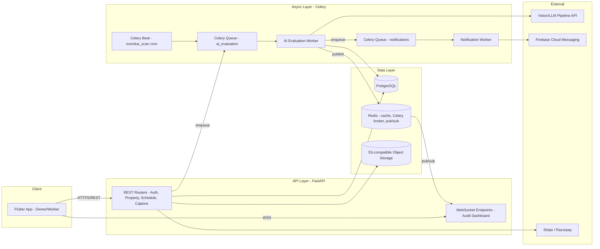
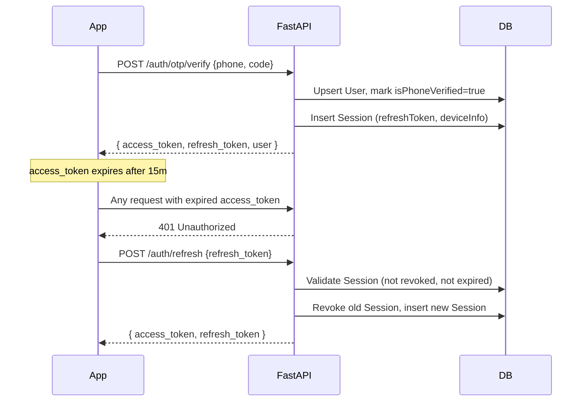
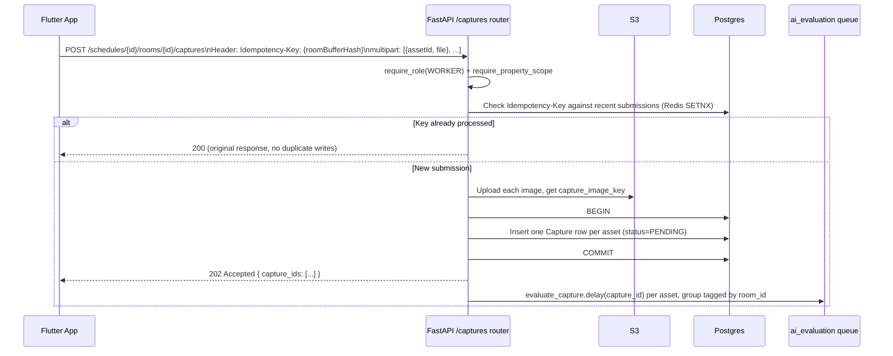
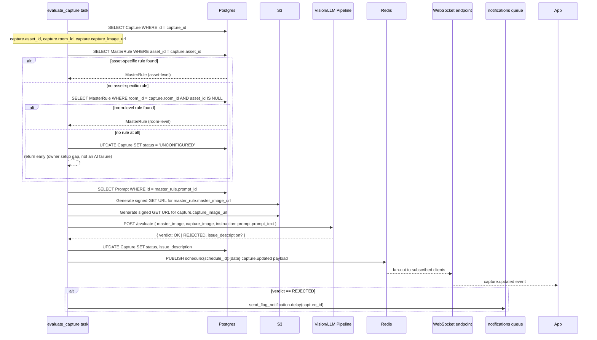
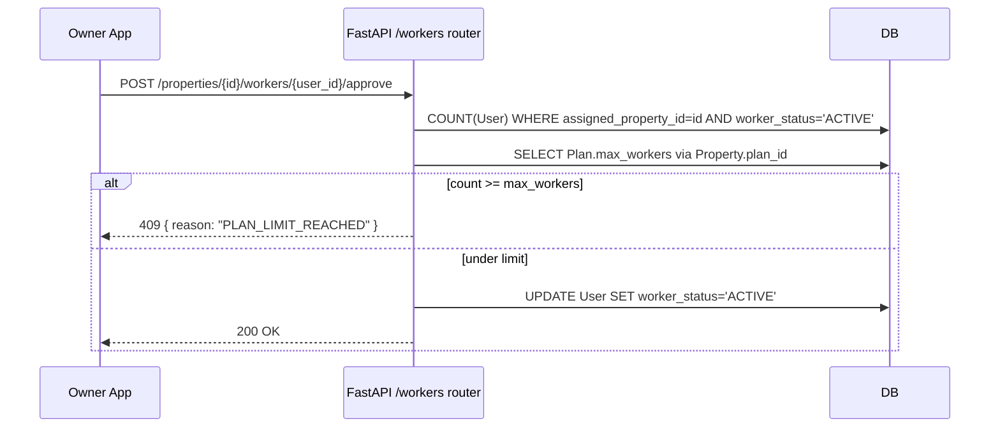

# Property Inspection SaaS — Backend Architecture & API Specification

**Version:** 1.1 (Python/FastAPI stack; adds detailed AI evaluation pipeline invocation workflow)

**Scope:** Backend services, API surface, async processing, and real-time infrastructure for the multi-tenant property inspection platform. Consumed by the Flutter Owner/Worker client described in the frontend spec.

**Status:** Draft for review — carries forward open decisions flagged in the DB spec (Prompt versioning, Schedule scope, Capture batching) as backend-facing risks rather than re-resolving them.

---

## 1. Purpose and Scope

This document specifies the backend service boundaries, the full REST API surface, the asynchronous AI evaluation pipeline (including exactly how the master image and capture image are resolved and dispatched per room/asset), and the real-time update mechanism the audit dashboard depends on. It assumes the schema in `db-model-technical-spec.md` v1.1 (flattened `User`, 1:1 `Asset`↔`MasterRule`, standalone `Prompt`) and the client workflows in `frontend-architecture-v3.md` v3.0 (room-level batch submission, deep-link/code worker onboarding).

It does **not** re-litigate schema decisions already flagged as open in the DB spec — where a backend behavior depends on one of those open items, this document states the assumption it's building against and flags it in Section 14.

---

## 2. High-Level Architecture

The system is a **modular monolith** for the transactional API, with a **separately deployable worker pool** for AI evaluation so image-processing load can scale independently of request/response traffic. Both share one Postgres instance and one Redis instance.



**Why a modular monolith over microservices at this stage:** the domain graph (`Property → Room → Asset → MasterRule`, `Property → Schedule → Capture`) is deeply relational and almost every write touches 2–3 tables in one transaction (e.g., approving a worker touches `User` and implicitly re-evaluates `Plan.maxWorkers`). Splitting these into separate services now would mean distributed transactions for no scaling benefit yet. The one component that *does* have an independent scaling and failure profile — AI evaluation, which calls an external vision pipeline and can back up under load — is pulled out as its own worker pool from day one.

### 2.1 Service Modules (FastAPI routers + service layer)

Each module below is a FastAPI `APIRouter` plus a plain-Python service class it delegates to (kept separate so the service logic is testable without spinning up the ASGI app). The AI evaluation and notification modules are not routers at all — they're Celery task modules imported by the worker process.

| Module | Owns | Depends on |
|---|---|---|
| `auth` | Registration, OTP, Google auth, JWT issuance, refresh/revoke | `User`, `Session` |
| `users` | Profile, role selection, device token registration | `User` |
| `properties` | Property CRUD, verification workflow, plan assignment | `Property`, `Plan` |
| `workers` | Invite-link/code join, approval queue, offboarding | `User`, `Property` |
| `rooms_assets` | Room and Asset CRUD | `Room`, `Asset` |
| `rules` | `Prompt` CRUD, `MasterRule` CRUD, baseline image association | `Prompt`, `MasterRule` |
| `schedules` | Schedule CRUD, checklist resolution | `Schedule`, `Room`, `Asset` |
| `captures` | Room batch ingestion, single re-capture ingestion, override | `Capture` |
| `audit` | Read-model aggregation for the audit dashboard | `Capture`, `Schedule`, `Room` |
| `tasks.ai_evaluation` (Celery, separate process) | Resolves master/capture images per asset, calls the vision pipeline, writes verdicts | `Capture`, `MasterRule`, `Prompt` |
| `tasks.notifications` (Celery, separate process) | Consumes evaluation results, sends FCM push | none (stateless relay) |
| `billing` | Stripe/Razorpay checkout session, webhook handling | `Plan`, `Property` |

---

## 3. Tech Stack

| Layer | Choice | Rationale |
|---|---|---|
| **Runtime / Framework** | Python 3.12 + **FastAPI** | Async-native (matters for Section 7's S3/vision I/O); Pydantic v2 schemas map directly onto the DB spec's typed fields and double as request/response validation; `Depends()` composes auth, role, and tenant-scope checks onto each route, as described in Section 5. |
| **ORM / migrations** | SQLAlchemy 2.0 (async engine, `asyncpg` driver) + Alembic | Schema-first, matches the ER model in the DB spec 1:1; Alembic gives reviewable migration files for the `MasterRule.assetId` unique-constraint change called out in Section 14. |
| **Validation layer** | Pydantic v2 | Request/response models per route; also the schema the Celery tasks use internally when passing structured data between steps (e.g., the resolved `MasterRule` payload in Section 7.2). |
| **Primary datastore** | PostgreSQL | Relational integrity for the FK-heavy schema. |
| **Background jobs** | **Celery** + Redis as broker and result backend | Mature retry/backoff/dead-letter semantics out of the box; `Celery Beat` covers the overdue-scan cron in Section 7.5 without a separate scheduler service. |
| **Cache / Pub-Sub** | Redis | Same Redis instance backs Celery, the idempotency-key cache described in Section 7.1, and WebSocket fan-out described in Section 9. |
| **Real-time transport** | FastAPI native `WebSocket` endpoints, fan-out via `redis.asyncio` pub/sub | No extra framework needed — FastAPI's WebSocket support plus a thin Redis-subscribe loop per connection covers the "join a schedule+date room" pattern. |
| **Object storage** | S3-compatible bucket (AWS S3 or R2), accessed via `boto3` | Stores `masterImageUrl` and `captureImageUrl` binaries; presigned URLs generated server-side, binary never touches the API process. |
| **HTTP client for the vision pipeline** | `httpx` (async) | Used by the Celery task in Section 7.2 to call the vision/LLM pipeline without blocking the worker's event loop when running Celery in async mode (or via `asyncio.run` per task if using a sync worker pool). |
| **Auth** | `PyJWT` for access tokens, `passlib[bcrypt]` for password hashing, opaque refresh tokens in `Session` | Matches `Session.refreshToken`/`isRevoked`/`expiresAt` in the DB spec. |
| **Push notifications** | Firebase Admin SDK (Python) | Matches `firebase_messaging` on the client. |
| **Payments** | Stripe Python SDK (primary) / Razorpay Python SDK (region fallback) | Matches client SDK choice in frontend spec. |

---

## 4. Authentication & Session Architecture

### 4.1 Token model

- **Access token:** JWT (signed with `PyJWT`), 15-minute TTL, payload `{ sub: userId, role, assigned_property_id, worker_status }`. Never persisted server-side — validity is purely signature + expiry.
- **Refresh token:** opaque random string, persisted as a `Session` row (`userId`, `refreshToken` hashed at rest, `deviceInfo`, `ipAddress`, `isRevoked`, `expiresAt`). 30-day TTL, rotated on every use (old row marked `isRevoked = true`, new row issued).

### 4.2 Flow



This maps directly to Edge Case #1 in the frontend spec ("Dio `QueuedInterceptor` handles silent refresh on 401"). The backend contract it depends on: **exactly one valid refresh per token**, so concurrent requests racing to refresh must be serialized client-side.

### 4.3 Google Sign-In

`POST /auth/google` accepts a Google ID token, verifies it server-side (`google-auth` library) against Google's public keys, and either creates a `User` with `authProvider = GOOGLE`, `passwordHash = null`, or logs into an existing one matched by `email`. Still requires the OTP step afterward, since `isPhoneVerified` — not email — is the identity gate.

---

## 5. Authorization Model

Three layers, applied as FastAPI dependencies (`Depends(...)`) composed onto each route:

1. **`get_current_user`** — validates the access token, returns the authenticated user (raises `401`).
2. **`require_role(*roles)`** — checks `user.role` against the route's allowed roles (`OWNER`, `WORKER`, or both) (raises `403`).
3. **`require_property_scope`** — the multi-tenancy enforcement layer. Resolves the target resource's `propertyId` (from a path param or a DB lookup) and checks it against:
   - For a **Worker**: `user.assigned_property_id == resource.property_id` **and** `user.worker_status == "ACTIVE"`.
   - For an **Owner**: `resource.property.owner_id == user.id`.

```python
# Example composition on a route
@router.post("/schedules/{schedule_id}/rooms/{room_id}/captures")
async def submit_room_batch(
    schedule_id: str,
    room_id: str,
    payload: RoomBatchRequest,
    user: User = Depends(get_current_user),
    _: None = Depends(require_role("WORKER")),
    _scope: None = Depends(require_property_scope(resource="room", id_param="room_id")),
):
    ...
```

This dependency chain is what turns "every downstream table scopes back to a Property" from a data-modeling statement into an enforced runtime invariant — without it, a worker with a valid token for Property A could submit captures against Property B's `roomId` simply by changing the URL parameter.

A worker whose `worker_status = PENDING` can authenticate but every route in `schedules`, `rooms_assets` (read), and `captures` returns `403` until an owner approves them.

---

## 6. API Route Reference

Unchanged from the transactional shape already specified — all routes are prefixed `/api/v1`, implemented as FastAPI routers per module. Role column: **O** = Owner only, **W** = Worker only, **Both**, **Public** = no auth required. (Full table retained from v1.0; reproduced here for completeness.)

### 6.1 Auth & Onboarding

| Method | Route | Role | Description |
|---|---|---|---|
| POST | `/auth/register` | Public | Email/password signup. |
| POST | `/auth/google` | Public | Google ID token exchange. |
| POST | `/auth/otp/send` | Public | Sends 6-digit SMS OTP. |
| POST | `/auth/otp/verify` | Public | Verifies OTP, issues token pair. |
| POST | `/auth/refresh` | Public (refresh token in body) | Rotates `Session`, issues new pair. |
| POST | `/auth/logout` | Both | Revokes current device `Session`. |
| POST | `/auth/logout-all` | Both | Revokes every `Session` for the user. |
| POST | `/users/me/role` | Both | Sets `User.role` on first login. |

### 6.2 Worker Onboarding & Approval

| Method | Route | Role | Description |
|---|---|---|---|
| GET | `/workers/invite/{token}` | Public | Resolves deep-link token to property preview. |
| POST | `/workers/invite/{token}/accept` | W | Sets `assignedPropertyId`, `invitedVia=LINK`, `workerStatus=ACTIVE`. |
| POST | `/workers/join-by-code` | W | Sets `workerStatus=PENDING` for manual code entry. |
| GET | `/properties/{property_id}/workers/requests` | O | Pending approval queue. |
| POST | `/properties/{property_id}/workers/{user_id}/approve` | O | Approves, gated by `Plan.maxWorkers` as described in Section 7.3. |
| POST | `/properties/{property_id}/workers/{user_id}/reject` | O | Sets `workerStatus=REJECTED`. |
| GET | `/properties/{property_id}/workers` | O | Full roster. |
| DELETE | `/properties/{property_id}/workers/{user_id}` | O | Offboards a worker. |

### 6.3 Property & Plan

| Method | Route | Role | Description |
|---|---|---|---|
| POST | `/properties` | O | Creates `Property`. |
| GET | `/properties` | O | Lists caller's properties. |
| GET | `/properties/{property_id}` | O | Property detail. |
| PATCH | `/properties/{property_id}` | O | Update fields. |
| POST | `/properties/{property_id}/verification-docs` | O | Sets `verificationDocUrl`. |
| GET | `/properties/{property_id}/verification-status` | O | Polls status. |
| GET | `/plans` | Public | Lists `Plan` tiers. |
| POST | `/properties/{property_id}/plan/checkout` | O | Creates payment checkout session. |
| POST | `/billing/webhook` | Public (signature-verified) | Payment webhook. |

### 6.4 Rooms & Assets

| Method | Route | Role | Description |
|---|---|---|---|
| POST | `/properties/{property_id}/rooms` | O | Creates `Room`. |
| GET | `/properties/{property_id}/rooms` | Both | Room list. |
| GET | `/rooms/{room_id}` | Both | Room detail. |
| PATCH | `/rooms/{room_id}` | O | Update. |
| DELETE | `/rooms/{room_id}` | O | Soft-delete (blocked if in-use). |
| POST | `/rooms/{room_id}/assets` | O | Creates `Asset`. |
| GET | `/rooms/{room_id}/assets` | Both | Asset list. |
| PATCH | `/assets/{asset_id}` | O | Update. |
| DELETE | `/assets/{asset_id}` | O | Blocked if referenced by a `MasterRule` or open `Capture`. |

### 6.5 Prompts & Master Rules

| Method | Route | Role | Description |
|---|---|---|---|
| POST | `/prompts` | O | Creates reusable `Prompt`. |
| GET | `/prompts` | O | Lists prompts. |
| PATCH | `/prompts/{prompt_id}` | O | Edits text; see Section 14.1. |
| POST | `/rooms/{room_id}/master-rules` | O | Creates room-level rule (`assetId=null`). |
| POST | `/assets/{asset_id}/master-rules` | O | Creates/replaces the asset's single rule (upsert, unique constraint). |
| GET | `/rooms/{room_id}/master-rules` | Both | All rules for a room. |
| PATCH | `/master-rules/{rule_id}` | O | Update image/prompt link. |
| POST | `/uploads/presign` | Both | S3 presigned PUT URL. |

### 6.6 Schedules

| Method | Route | Role | Description |
|---|---|---|---|
| POST | `/properties/{property_id}/schedules` | O | Creates `Schedule`. |
| GET | `/properties/{property_id}/schedules` | O | Lists schedules. |
| GET | `/schedules/{schedule_id}` | Both | Detail. |
| PATCH | `/schedules/{schedule_id}` | O | Update timing/recurrence. |
| DELETE | `/schedules/{schedule_id}` | O | Deactivates. |
| GET | `/workers/me/schedules` | W | Worker dashboard list. |
| GET | `/schedules/{schedule_id}/checklist` | W | Room×asset checklist with today's status. |

### 6.7 Captures

| Method | Route | Role | Description |
|---|---|---|---|
| POST | `/schedules/{schedule_id}/rooms/{room_id}/captures` | W | Room batch submission, as described in Section 7.1. |
| GET | `/captures/{capture_id}` | Both | Single capture detail. |
| GET | `/workers/me/recapture-queue` | W | All `REJECTED` captures for the worker's property. |
| POST | `/captures/{capture_id}/recapture` | W | Submits corrected image, re-triggers evaluation. |
| POST | `/captures/{capture_id}/override` | O | Manual `REJECTED → OK` override with reason. |

### 6.8 Audit Dashboard & Real-Time

| Method | Route | Role | Description |
|---|---|---|---|
| GET | `/schedules/{schedule_id}/audit?date=YYYY-MM-DD` | Both | Aggregated matrix, REST fallback / initial load. |
| WS | `/ws/schedules/{schedule_id}?date=YYYY-MM-DD` | Both | Live `capture.updated` events for that schedule+date. |

### 6.9 Notifications

| Method | Route | Role | Description |
|---|---|---|---|
| POST | `/users/me/device-tokens` | Both | Registers FCM token. |
| DELETE | `/users/me/device-tokens/{token}` | Both | Deregisters. |

---

## 7. Core Use Cases

### 7.1 Room-Level Batch Capture Submission



**Idempotency key required** because the frontend's offline-resilience rule (payload stays `READY_FOR_SYNC` and retries on reconnect) means the same multipart payload can legitimately hit this endpoint twice. **All-or-nothing per room** — the insert runs inside one DB transaction, mirroring the client's "Submit Room" completion guard. **202, not 201** — verdicts land asynchronously; the client's "Mark room Submitted" transition fires on this response, independent of when AI verdicts arrive.

### 7.2 AI Evaluation Pipeline — Master/Capture Image Resolution & Invocation

This is the workflow that, given a `Capture` row, figures out **which** master image and prompt to compare it against, and how the two images are actually sent to the vision pipeline.

**Resolution rule (from the DB spec's `MasterRule` design):** an asset may have its own `MasterRule` (`assetId` set — the precise, item-specific standard), or it may fall back to its room's whole-room `MasterRule` (`assetId = NULL`). Asset-specific always wins when both exist, since it's the more precise standard.



**Reference implementation (Celery task):**

```python
# tasks/ai_evaluation.py
from celery import shared_task
from app.db import SessionLocal
from app.models import Capture, MasterRule, Prompt
from app.storage import generate_signed_get_url
from app.vision_client import evaluate_images  # thin httpx wrapper around the pipeline
from app.realtime import publish_capture_update
from app.tasks.notifications import send_flag_notification


def resolve_master_rule(db, asset_id: str, room_id: str) -> MasterRule | None:
    """Asset-specific rule wins; falls back to the room's whole-room rule."""
    asset_rule = (
        db.query(MasterRule)
        .filter(MasterRule.asset_id == asset_id)
        .one_or_none()
    )
    if asset_rule:
        return asset_rule

    return (
        db.query(MasterRule)
        .filter(MasterRule.room_id == room_id, MasterRule.asset_id.is_(None))
        .one_or_none()
    )


@shared_task(bind=True, max_retries=3, default_retry_delay=30)
def evaluate_capture(self, capture_id: str) -> None:
    db = SessionLocal()
    try:
        capture = db.get(Capture, capture_id)
        if capture is None:
            return  # defensive — should not happen if enqueue is transactional

        master_rule = resolve_master_rule(db, capture.asset_id, capture.room_id)
        if master_rule is None:
            # No baseline configured for this asset or its room — an owner
            # setup gap, not an evaluation failure. Do not retry.
            capture.status = "UNCONFIGURED"
            db.commit()
            return

        prompt = db.get(Prompt, master_rule.prompt_id)

        master_image_url = generate_signed_get_url(master_rule.master_image_url)
        capture_image_url = generate_signed_get_url(capture.capture_image_url)

        try:
            result = evaluate_images(
                master_image_url=master_image_url,
                capture_image_url=capture_image_url,
                instruction=prompt.prompt_text,
            )
        except Exception as exc:
            # Transient pipeline failure — retry with backoff, per Celery's
            # policy above. After max_retries, on_failure below marks it.
            raise self.retry(exc=exc)

        capture.status = result.verdict           # "OK" | "REJECTED"
        capture.issue_description = result.issue_description
        db.commit()

        publish_capture_update(capture)  # Redis PUBLISH -> WebSocket fan-out

        if result.verdict == "REJECTED":
            send_flag_notification.delay(capture_id)
    finally:
        db.close()


@evaluate_capture.on_failure
def _on_evaluation_exhausted(self, exc, task_id, args, kwargs, einfo):
    """Runs once retries are exhausted — see Section 14.2 for the missing enum value
    this depends on."""
    capture_id = args[0]
    db = SessionLocal()
    try:
        capture = db.get(Capture, capture_id)
        capture.status = "EVALUATION_FAILED"
        db.commit()
        publish_capture_update(capture)
    finally:
        db.close()
```

**`evaluate_images` — the actual call to the vision pipeline:**

```python
# app/vision_client.py
import httpx
from pydantic import BaseModel

class EvaluationResult(BaseModel):
    verdict: str               # "OK" | "REJECTED"
    issue_description: str | None = None

async def _call_pipeline(master_image_url: str, capture_image_url: str, instruction: str) -> dict:
    async with httpx.AsyncClient(timeout=30.0) as client:
        response = await client.post(
            settings.VISION_PIPELINE_URL,
            json={
                "master_image_url": master_image_url,
                "capture_image_url": capture_image_url,
                "instruction": instruction,
            },
            headers={"Authorization": f"Bearer {settings.VISION_PIPELINE_API_KEY}"},
        )
        response.raise_for_status()
        return response.json()

def evaluate_images(master_image_url: str, capture_image_url: str, instruction: str) -> EvaluationResult:
    payload = asyncio.run(_call_pipeline(master_image_url, capture_image_url, instruction))
    return EvaluationResult(**payload)
```

Two provider-shape options are worth deciding before this is wired up for real, since they change what `_call_pipeline` sends:

- **URL-based providers** (pipeline fetches the images itself): send the two signed GET URLs as shown above — simplest, no bytes flow through the worker.
- **Bytes-based providers** (pipeline expects base64-encoded image data in the request body, e.g. a raw multimodal LLM call): the worker must first `httpx.get()` both images from S3 and base64-encode them before the pipeline call. This roughly doubles the worker's outbound bandwidth per evaluation and should factor into worker pool sizing if the chosen provider requires it.

**Concurrency model:** jobs are enqueued **per capture, not per room**, tagged with `room_id` so the audit dashboard can show partial progress ("3 of 5 assets evaluated") within a room rather than waiting for the whole batch. Parallelism happens at the Celery worker-pool level (`--concurrency=N`), not by fanning a single room out into one pipeline call.

**Failure handling:** `max_retries=3` with backoff via Celery's built-in retry; after exhaustion, `_on_evaluation_exhausted` sets a dedicated `EVALUATION_FAILED` status (see Section 14.2 — this needs a new enum value, not currently in `CaptureStatus`) so the dashboard can distinguish "still processing" from "stuck."

### 7.3 Worker Approval & Plan Enforcement



This is the server-side half of the frontend's Edge Case #3 — the client's plan-limit modal only fires because this endpoint returns a structured `409` it can pattern-match on.

### 7.4 Checklist & Audit Aggregation (read-time, by design)

Per the DB spec's explicitly-noted trade-off, both `GET /schedules/{id}/checklist` and `GET /schedules/{id}/audit` run pure aggregation queries via SQLAlchemy, not reads of a materialized table:

```python
stmt = (
    select(
        Room.id.label("room_id"),
        Room.name,
        func.count(Asset.id).label("total_assets"),
        func.count(Capture.id).filter(Capture.status == "OK").label("ok_count"),
        func.count(Capture.id).filter(Capture.status == "REJECTED").label("rejected_count"),
    )
    .join(Asset, Asset.room_id == Room.id)
    .outerjoin(
        Capture,
        and_(
            Capture.asset_id == Asset.id,
            Capture.schedule_id == schedule_id,
            Capture.capture_date == target_date,
        ),
    )
    .where(Room.property_id == property_id)
    .group_by(Room.id)
)
```

Kept as a query rather than a cached read model for v1, accepting the DB spec's stated trade-off. It's covered by the `(propertyId, captureDate)` and `status` indexes already specified on `Capture`. If dashboard read latency becomes a problem, the fix is a Redis-cached aggregate invalidated on `capture.updated` — not a schema change.

### 7.5 Overdue Submission Flagging (Grace Period)

Handled by **Celery Beat** (a repeatable task, runs every minute) rather than a request-time check:

1. Queries all `RECURRING` schedules whose computed window (`startTimeMinutes + gracePeriodMinutes`) has just elapsed for the property's timezone.
2. For each, finds rooms with no `OK`/`REJECTED` capture today.
3. Writes an `OVERDUE_SUBMISSION` flag — needs a home; see Section 14.4.

---

## 8. Async Processing & Queue Architecture

| Queue | Producer | Consumer (Celery task) | Concurrency | Retry policy |
|---|---|---|---|---|
| `ai_evaluation` | `captures` router (on batch submit and on recapture) | `tasks.ai_evaluation.evaluate_capture` | `celery worker -Q ai_evaluation --concurrency=N`, scaled to pipeline rate limits | `max_retries=3`, exponential backoff, `on_failure` marks `EVALUATION_FAILED` |
| `notifications` | `ai_evaluation` task (on REJECTED), `schedules` (on overdue) | `tasks.notifications.send_flag_notification` | High concurrency (I/O-bound FCM calls) | 2 attempts; push failures logged, not user-facing |
| `overdue_scan` | Celery Beat (repeatable schedule) | `tasks.schedules.scan_overdue` | 1 (Beat is a single scheduler; Redis lock guards double-firing across replicas) | Re-runs next minute regardless |

The AI evaluation worker(s) run as a **separate deployable process** (`celery -A app.worker worker -Q ai_evaluation`) from the FastAPI process — the one component whose load is bursty and decoupled from API request volume, so it scales independently (e.g., via KEDA on Celery queue depth).

---

## 9. Real-Time Update Architecture

- **Transport:** native FastAPI `WebSocket` routes. A client connects to `/ws/schedules/{schedule_id}?date=...`, the endpoint validates the JWT from the connection query/header, re-applies the same tenant-scope check as the REST routes, then subscribes to a Redis pub/sub channel named `schedule:{schedule_id}:{date}`.
- **Fan-out across instances:** the FastAPI app runs on multiple uvicorn/gunicorn workers behind a load balancer. The Celery `evaluate_capture` task publishes to Redis; every FastAPI instance's WebSocket handler is independently subscribed to the same channel via `redis.asyncio.client.pubsub()`, so a publish from any worker reaches whichever instance holds the relevant socket.
- **Connection lifecycle:** each WebSocket handler runs an `asyncio` task that awaits messages from its Redis subscription and forwards them to the client as JSON; on disconnect, it unsubscribes and cancels the task.

---

## 10. File & Media Storage Architecture

1. **Upload:** client calls `POST /uploads/presign` (`{purpose: "capture" | "baseline", content_type}`); FastAPI generates a presigned S3 `PUT` via `boto3` (5-minute TTL) and returns the URL plus the object key. The client uploads directly to S3.
2. **Read:** baseline images are served through a CDN in front of the bucket (repeatedly fetched by every worker capturing that asset, for the ghosted overlay). Capture images are served via short-lived signed `GET` URLs — smaller audience, no CDN caching needed.
3. **Pipeline access, as described in Section 7.2:** the `evaluate_capture` task generates its own signed `GET` URLs server-side (distinct from the client-facing upload URLs), scoped to that evaluation's lifetime, and passes them — or the downloaded/base64 bytes, depending on the provider shape — to the vision pipeline.

---

## 11. Rate Limiting & Abuse Prevention

| Surface | Limit | Reasoning |
|---|---|---|
| `POST /auth/otp/send` | 3 per phone number / 10 min | SMS cost control. |
| `POST /schedules/{id}/rooms/{id}/captures` | 1 concurrent in-flight submission per `(worker_id, room_id)` | Prevents a buggy retry loop from stacking idempotency-check round trips. |
| `POST /uploads/presign` | 60/min per user | Prevents presign-URL harvesting. |
| Global | 100 req/min per user (Redis sliding window, e.g. `slowapi`) | Baseline ceiling; well above a legitimate room submission's request count. |

---

## 12. Observability

- **Structured logging:** every request logged with `request_id`, `user_id`, `property_id` — the join key for cross-tenant debugging.
- **Metrics:** Celery queue depth and task latency for `ai_evaluation` are the leading indicator of the pipeline described in Section 7.2 backing up; alert on queue depth, not just failure rate.
- **Tracing:** a single `capture_id` (plus a batch-level `trace_id` carried on the Celery task's kwargs) correlates the room-submission → evaluation → WebSocket-broadcast path across the API process, the worker process, and the pub/sub hop.

---

## 13. Environment & Deployment Notes

- FastAPI app and Celery workers are separate containers sharing one Postgres and one Redis; the worker pool scales on queue depth independently of API instance count (which scales on request concurrency).
- Alembic migrations run in CI before deploy. The `MasterRule.asset_id` unique constraint (a Postgres partial-unique index, since Postgres treats `NULL` as distinct under uniqueness — correctly, per the DB spec) should ship as its own reviewed migration.

---

## 14. Open Items Carried Forward / Flagged for Backend Impact

### 14.1 Prompt versioning (from DB spec, Section 4.7)
`PATCH /prompts/{id}` assumes mutable-in-place prompts. If immutable-per-version is chosen instead, this becomes a `POST /prompts/{id}/versions` create instead of an update, and every `MasterRule.prompt_id` that pointed at the old version needs an explicit migration decision.

### 14.2 Missing "evaluation failed" capture state (Section 7.2)
`CaptureStatus` (`PENDING`, `OK`, `REJECTED`) has no value for "pipeline call failed after retries" — the reference implementation above writes `EVALUATION_FAILED`, which doesn't exist in the current enum yet. Needs an enum migration before `on_failure` can ship as written. Same applies to `UNCONFIGURED` (asset/room has no `MasterRule` at all) used in the resolution fallback.

### 14.3 Owner override needs an audit trail (Section 6.7)
No table currently holds who overrode a capture and why. Recommend a `capture_override_log` table (`capture_id`, `overridden_by`, `reason_note`, `previous_status`, `created_at`) rather than overwriting `issue_description`.

### 14.4 Overdue flag has no home (Section 7.5)
`OVERDUE_SUBMISSION` needs a table (`schedule_id`, `room_id`, `date`, `flagged_at`) since a room can be overdue with zero `Capture` rows to attach a flag to.

### 14.5 Schedule scope and worker 1:1 (from DB spec, Section 6)
Inherited as-is: no route exists for room-subset or worker-subset schedule targeting because the schema doesn't support it. If that changes upstream, new endpoints are additive (`POST /schedules/{id}/rooms`, `POST /schedules/{id}/workers`) rather than modifications to existing ones.
