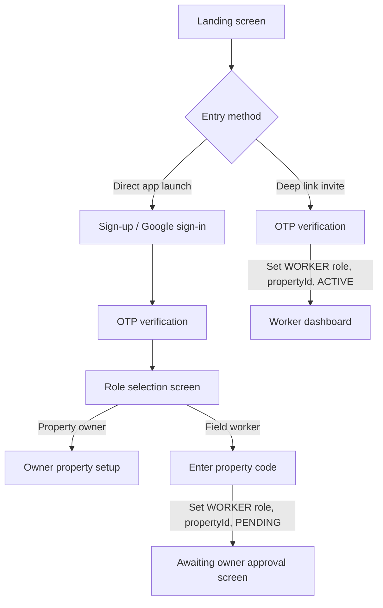
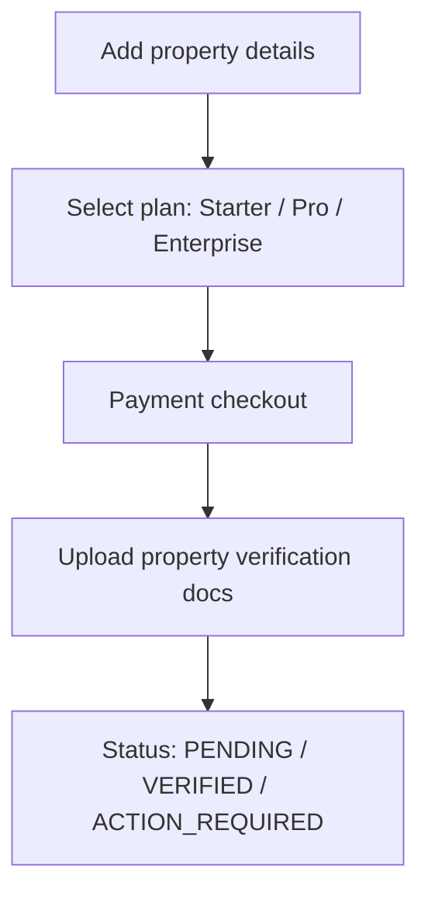
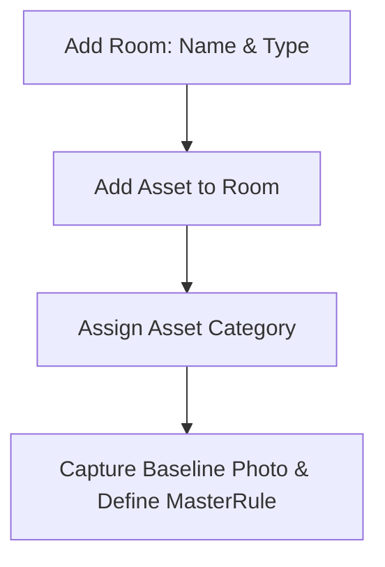
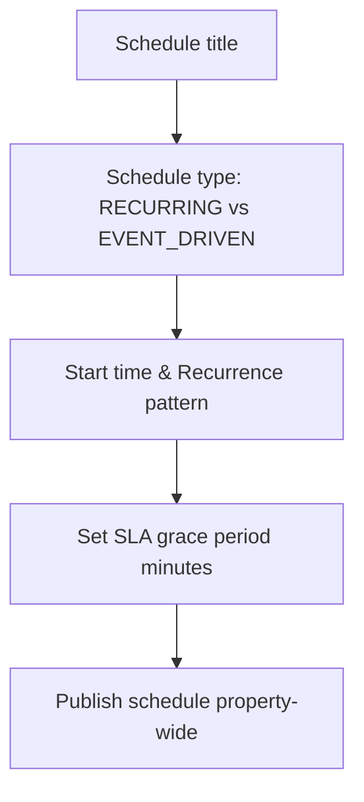
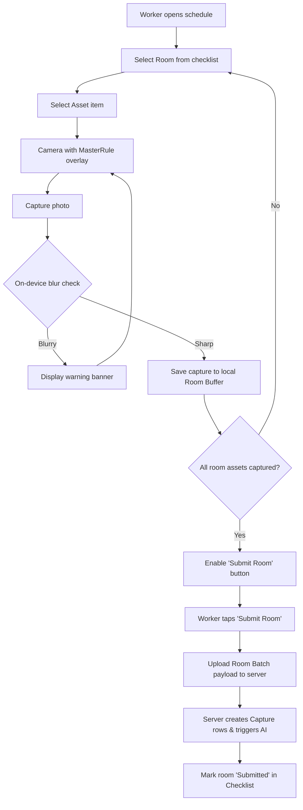
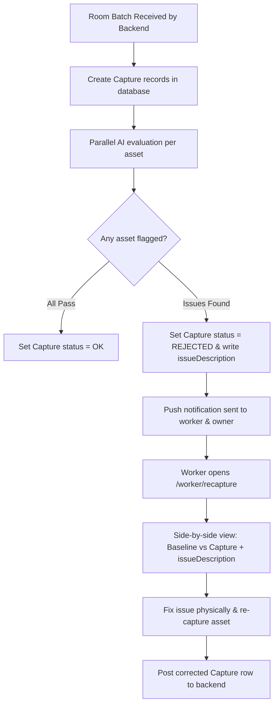

# Property Inspection SaaS — Frontend Architecture & Workflow Specification

**Version:** 3.0 (Aligned with Room-Level Batch Submission Architecture)

**Platform:** Flutter (cross-platform mobile, single codebase for Owner and Worker roles)

**Status:** Approved for Implementation

---

## 1. Purpose and Scope

This document specifies the frontend architecture, screen flows, and navigation model for the property inspection platform. It covers the Owner (property manager) journey from signup through property configuration, and the Worker (field staff) journey from onboarding through daily capture and re-capture. It also documents gaps identified during review that should be resolved before implementation begins.
It reflects the finalized backend database architecture:

* **Flattened User Schema:** Worker assignments (`assignedPropertyId`, `workerStatus`, `invitedVia`) live directly on the `User` table ($1:1$ worker-to-property relationship).
* **Property-Wide Schedules:** Schedules apply property-wide without room or worker filter junction tables. All active staff share the property inspection queue.
* **Room-Level Batch Submissions:** Inspection photos are captured into a local **Draft Room Buffer** and submitted to the backend as a single multipart batch per room, creating individual `Capture` records linked directly to `Schedule.id`.
* **Asynchronous AI Evaluation:** Processing happens concurrently per room batch, driving real-time flag/pass status updates on the shared audit dashboard.

---

## 2. Tech Stack & Infrastructure

| Layer | Choice | Operational Role & Mechanics |
| --- | --- | --- |
| **State Management** | Riverpod (`flutter_riverpod`) | `AsyncNotifier` streams auth state, property trees, and room completion checklists in real time. |
| **Routing** | `go_router` | Declarative routing with guard conditions based on `User.role`, `User.workerStatus`, and `User.assignedPropertyId`. |
| **Local Database / Cache** | Isar or Hive | Acts as the **Draft Room Buffer** and offline persistence layer for unsubmitted room capture payloads. |
| **Camera Engine** | `camera` + `CustomPainter` | Displays ghosted alignment overlays derived from `MasterRule.masterImageUrl` (~30% opacity). |
| **On-Device Quality Gate** | OpenCV / Blur Plugin | Computes Laplacian variance on captured frames prior to writing them to the local room buffer. |
| **Networking** | `dio` | Handles auth token refresh interceptors and posts room multipart payloads (`POST /schedules/{scheduleId}/rooms/{roomId}/captures`). |
| **Push Notifications** | `firebase_messaging` | Directs workers to re-capture routes (`/worker/recapture?captureId=...`) or new schedule alerts. |
| **Payments** | Stripe / Razorpay SDK | Manages initial subscription tier selection during owner onboarding. |

---

## 3. Master Route Map

| Route | Role | Screen Description |
| --- | --- | --- |
| `/auth/register` | Public | Signup method selection (Google Auth vs. Email/Password) |
| `/auth/otp-verify` | Public | 6-digit SMS OTP verification screen |
| `/auth/select-role` | Public | Role selection (Bypassed entirely for deep-link worker invites) |
| `/owner/add-property` | Owner | Property registration (Name, Type, Address via Google Maps) |
| `/owner/choose-plan` | Owner | Subscription tier comparison & payment checkout |
| `/owner/verify-property` | Owner | Business verification document upload |
| `/owner/rooms/add` | Owner | Room configuration & room type assignment |
| `/owner/rooms/assets/add` | Owner | Asset/element setup with baseline photos & master rules |
| `/owner/schedules/manage` | Owner | Property-wide schedule creation (Time, Recurrence, SLA) |
| `/owner/workers/requests` | Owner | Approval queue for workers requesting access via Property Code |
| `/worker/onboarding` | Worker | Manual property code entry or deep-link verification |
| `/worker/dashboard` | Worker | Active schedule list & overall property progress overview |
| `/worker/room-checklist` | Worker | Property room list displaying room status (*Pending*, *Draft*, *Submitted*) |
| `/worker/capture-engine` | Worker | In-room camera viewfinder with asset-specific baseline alignment overlays |
| `/worker/room-review` | Worker | Pre-upload preview gallery of captured asset photos for a specific room |
| `/worker/recapture` | Worker | Targeted correction view for AI-flagged `REJECTED` capture assets |
| `/shared/schedule-audit/{schedule_id}/{date}` | Both | Real-time property audit matrix and room completion log |

---

## 4. Authentication & Onboarding Workflow



### Authentication Rules

1. **Deep-Link Invite Integration:** If the app launches via `app://property/join?token=XYZ`, the onboarding pipeline bypasses `/auth/select-role`. Upon successful OTP verification, the backend automatically writes:
* `User.role = WORKER`
* `User.assignedPropertyId = property_id_from_token`
* `User.invitedVia = LINK`
* `User.workerStatus = ACTIVE`


2. **Manual Code Entry:** If a worker selects "Field Worker" manually and enters a 6-digit property code:
* `User.role = WORKER`
* `User.assignedPropertyId = property_id_from_code`
* `User.invitedVia = CODE`
* `User.workerStatus = PENDING`


3. **Owner Accounts:** Owners set `User.role = OWNER`. The fields `assignedPropertyId`, `workerStatus`, and `invitedVia` remain `NULL`.

---

## 5. Owner Workflow & Property Setup

### 5.1 Property & Plan Onboarding



* **Property Fields:** Collects property name, `propertyType` (`HOTEL`, `CAFE`, `PG`, `CO_LIVING`, `RESORT`, `SHORT_TERM_RENTAL`), address, and timezone.
* **Plan Assignment:** Links `Property.planId` to the selected `Plan` tier (`maxRooms`, `maxWorkers`, `aiAnalysisFrequency`).

### 5.2 Room, Asset, and Master Rule Setup



* **Room Setup:** Owner configures individual rooms (`name`, `roomType` e.g., *Deluxe 101*, *Suite 202*).
* **Asset Setup:** Owner adds inspectable elements within a room (`name`, `category`: `ARCHITECTURAL`, `FURNITURE`, or `FIXTURE`).
* **Master Rule Creation:** Captures the master baseline photo (`masterImageUrl`) and writes inspection criteria (`ruleTxt`). Nullable `assetId` allows room-level general baselines alongside specific asset rules.

### 5.3 Property-Wide Scheduler



* **Property Scope:** Schedules are linked directly to `Property.id`. They do not contain room or worker filter subsets.
* **Open Worker Queue:** Any active worker where `User.assignedPropertyId == Property.id` and `User.workerStatus == ACTIVE` can execute any published schedule.

---

## 6. Worker Workflow & Room-Level Execution

### 6.1 Worker Dashboard & Checklist Resolution

When a worker opens an active schedule, the app dynamically constructs the inspection checklist:

$$\text{Fetch Checklist: } \texttt{Asset} \xrightarrow{\text{join}} \texttt{Room} \quad \text{WHERE } \texttt{Room.propertyId} = \texttt{User.assignedPropertyId}$$

The dashboard displays overall completion progress alongside a room-by-room status list (*Pending*, *In Progress*, *Submitted*).

### 6.2 Camera Capture Engine & Room-Level Batch Submission



### 6.3 Room Execution & Submission Mechanics

1. **Local Room Buffer (Isar/Hive):** As the worker captures photos for each asset within a room, image files and metadata are saved locally. No single-photo API calls are made during the camera loop.
2. **Completion Guard:** The "Submit Room" button remains disabled until **100% of required assets** within the selected room have a passing photo stored in the buffer.
3. **Room Batch Payload:** Tapping "Submit Room" executes a single multipart request containing all asset captures for that room:
```json
{
  "scheduleId": "sched_123",
  "roomId": "room_456",
  "captures": [
    { "assetId": "asset_789", "captureDate": "2026-09-22", "file": "...bytes..." },
    { "assetId": "asset_790", "captureDate": "2026-09-22", "file": "...bytes..." }
  ]
}

```


4. **Offline Resilience:** If the device loses connection during room submission, the entire room payload remains in Isar/Hive marked as `READY_FOR_SYNC`. A background sync service retries the upload when connectivity is restored while allowing the worker to proceed to other rooms offline.

---

## 7. AI Processing & Re-Capture Loop



### Re-Capture Mechanics

* Flagged items appear in the worker’s `/worker/recapture` queue with an explicit AI-generated note (e.g., *"Missing pillow on bed"*).
* Tapping "Re-capture" launches the camera with the corresponding `MasterRule` overlay active.
* Corrected captures post individually to update the specific `Capture` record status from `REJECTED` to `PENDING` $\rightarrow$ `OK`.

---

## 8. Resolved Architecture & Technical Decisions

| Architectural Area | Finalized Specification |
| --- | --- |
| **Worker-Property Linkage** | Strictly **1:1**. Stored directly on `User.assignedPropertyId`. Reassigning a worker overwrites this field. |
| **Worker Approval** | Code-based joins create a `PENDING` status on `User`. Owner approval updates `User.workerStatus = ACTIVE`. |
| **Scheduler Scoping** | **Property-Wide**. Schedules do not filter by rooms or assign specific workers. |
| **Capture Pipeline** | **Room-Level Batching**. Captures buffer locally per room and post together in a single API call upon room completion. |
| **Batch Aggregation Table** | **Removed (`InspectionSession`)**. Individual `Capture` records link directly to `Schedule.id`, `Asset.id`, and `User.id`. |
| **Offline Strategy** | Room-level payload retry backoff managed via Isar/Hive background queues. |

---

## 9. Remaining Technical Edge Cases for Implementation

1. **Auth Session Lifecycle:** Mobile API client must implement a Dio `QueuedInterceptor` to handle silent JWT access token refreshes using `Session.refreshToken` upon receiving HTTP 401 response codes.
2. **Mid-Inspection Schedule Grace Expiry:** If a schedule's `gracePeriodMinutes` expires while a worker is performing an inspection, the app allows ongoing room uploads but flags the audit log with an `OVERDUE_SUBMISSION` tag.
3. **Plan Limit Enforcement UI:** When an owner attempts to add a room or worker beyond their `Plan` caps (`maxRooms`, `maxWorkers`), the frontend intercepts the action with a modal redirecting to `/owner/choose-plan`.
4. **AI Flag Override Path:** The owner audit dashboard (`/shared/schedule-audit/{schedule_id}/{date}`) includes an owner-only action to manually override an AI `REJECTED` status to `OK` with an optional reason note.